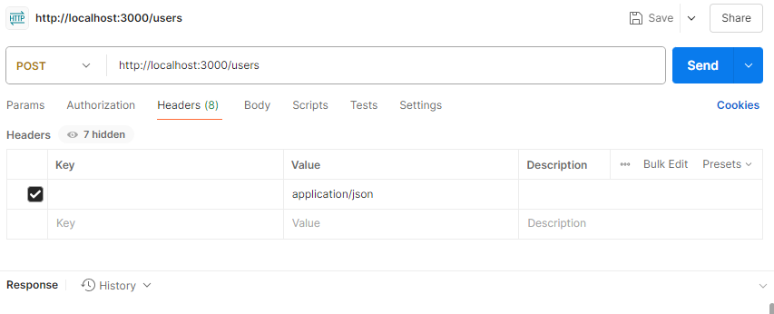
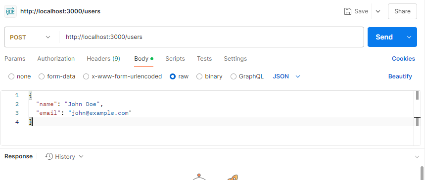
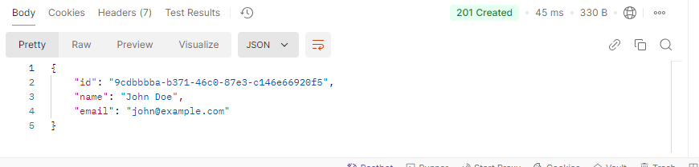
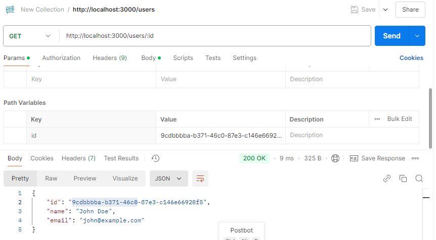

# Simple REST API

A lightweight REST API built with **Node.js** and **Express** for basic user management using in-memory storage.

---

## 🛠 Programming Language and Framework

- **Language:** JavaScript (Node.js)
- **Framework:** Express.js
- **UUID Generator:** [uuid](https://www.npmjs.com/package/uuid)
- **Storage:** In-memory (no database)

---

## 📋 Features

- Create users with auto-generated UUIDs
- Retrieve users by ID
- Input validation and duplicate email check
- JSON-formatted responses with appropriate error codes

---

## 🚀 Getting Started

### ✅ Prerequisites

- Node.js (v14 or later)
- npm (Node Package Manager)

---

## 📦 Installation

1. **Download the project ZIP** from GitHub:
   - Click the green **Code** button → **Download ZIP**
2. Extract the ZIP file to your local system.
3. Open the extracted folder in your terminal or **Visual Studio Code**.
4. In the terminal, run:

```bash
npm install
```

---

## ▶️ Running the API

### Step 1: Start the Server

Open your terminal and run:

```bash
npm start
```

This starts the API server at [http://localhost:3000](http://localhost:3000)

> ⚠️ Keep this terminal running.

---

## 📫 API Endpoints & Testing with Postman

### 1. Create a User

**Method:** `POST`  
**URL:** `http://localhost:3000/users`

#### 🧪 Postman Steps:

1. Open **Postman**
2. Set request method to `POST`
3. Set URL to `http://localhost:3000/users`
4. Go to the **Headers** tab:
   - Key: `Content-Type` → Value: `application/json`
   
5. Go to the **Body** tab → Choose `raw` → Select `JSON`
6. Paste the following body:

```json
{
  "name": "John Doe",
  "email": "john@example.com"
}
```


7. Click **Send**

#### ✅ Sample Response:



---

### 2. Get User by ID

**Method:** `GET`  
**URL:** `http://localhost:3000/users/:id`

#### 🧪 Postman Steps:

1. Copy the `id` from the response of the POST request.
2. Create a new `GET` request in Postman.
3. Set the URL to:

```
http://localhost:3000/users/<your-user-id>
```

4. Click **Send**

#### ✅ Sample Response:



## ⚠️ Error Handling

The API returns JSON-formatted error responses with appropriate status codes:

| Code | Meaning               |
|------|------------------------|
| 400  | Validation error       |
| 400  | Duplicate email        |
| 404  | User not found         |
| 500  | Internal server error  |

---

## 📁 Project Structure

```
testapi/
├── node_modules/         # Installed dependencies
├── package.json          # Metadata and scripts
├── package-lock.json     # Exact versions of packages
├── server.js             # Main Express server
└── README.md             # This file
```

---

## 📝 Notes

- Data is stored in memory only and will be lost when the server restarts
- Email is lowercased and must be unique
- Name and email are trimmed
- All timestamps are in ISO 8601 format
- UUIDs are used for unique user IDs

---

## 🪪 License

MIT License

---

